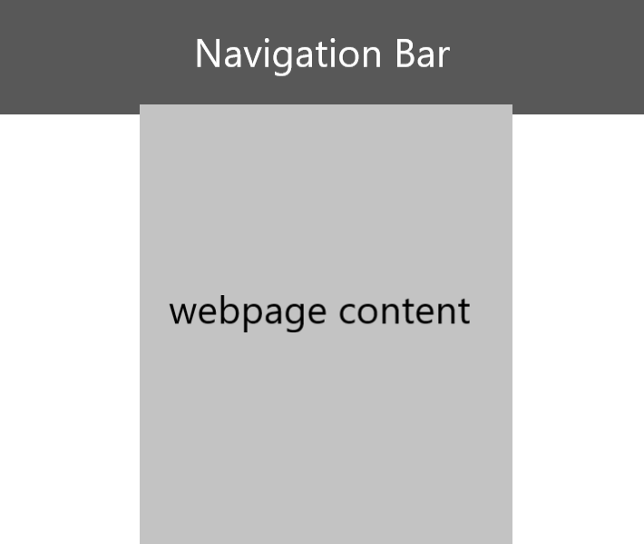

Two Design Heuristics I Want to Implement.
---
I want to use design heuristic 4 in my site. I'll achieve this by implementing a header that acts as the navigation bar, since that's where people can expect to see navigation.

I also want to incorporate design heuristic 5, error prevention. I'll ensure that when a user is entering in their data, that the data they enter is valid. They won't be able to enter in letters or symbols when a number is requested.
